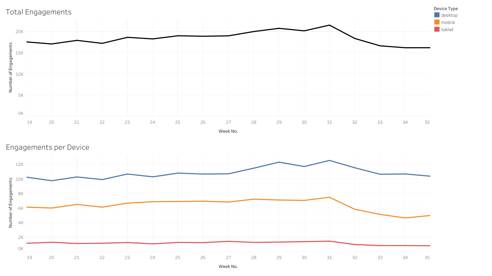

# Growth and Engagement Analysis

The data set used is a hypothethical representation of data coming from Yammer, an organizational communication software.

### Skills used:  
• **SQL** (Basic Queries, CTEs, Subqueries, Window Functions, Joins) for Data Wrangling  
• **Tableau** for Data Visualization

## Growth Analysis
To analyze app growth, the [yammer_users.csv](data/yammer_users.csv) was used to count the number of users created and activated per month. An SQL query ([01-growth-queries.sql](sql/01-growth-queries.sql)) was used to aggregate the data. The resulting data was visualized using Tableau.

## Engagement Analysis
The next analysis involves user engagement numbers on a weekly basis. It was discovered that there is a sharp drop on engagement on weeks 31 and 32. Further analysis was made to try to diagnose the reason for the drop.

The [yammer_events.csv](data/yammer_events.csv) dataset was joined with [yammer_users.csv](data/yammer_users.csv) to get needed data. Multiple SQL queries ([02-engagement-queries.sql](sql/02-engagement-queries.sql)) to separate engagements per device type used (an update might have broken an app feature), company (a company with a large userbase might have stopped using the app) and location (a localized server outage could have occured).

The following is a visualization of the engagements per week and the engagements per week per device type used:

Conclusion: All the visualizations show a similiar drop with its partitions. Among the hypothesis for the cause of the drop, it is best to look further in the broken app feature theory.
In an organizational setting, it might be best to discuss this with the developers especially if an update coincides with the dates of the engagement drop.